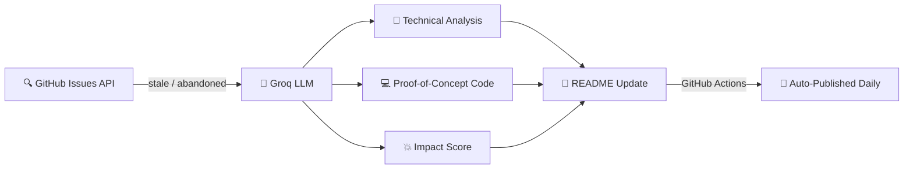

<div align="center">

<!-- SECTION:header -->

<br/>


<br/><br/>

> **Every abandoned GitHub issue is a spark that never ignited.**
> This lab finds them, analyses them with AI, and ships a proof-of-concept — daily.

<br/>


<!-- END:header -->

<br/>

---

## 💡 What Is This?

```
┌─────────────────────────────────────────────────────────────────┐
│                                                                 │
│   🔍  Scan GitHub for forgotten, stale & abandoned issues      │
│   🤖  Feed them to an AI model (Groq-powered)                  │
│   📐  Get: technical analysis + PoC code + impact score        │
│   🚀  Auto-publish results daily via GitHub Actions            │
│                                                                 │
└─────────────────────────────────────────────────────────────────┘
```

Think of it as **a robot archaeologist for open source ideas** — unearthing buried potential and turning it into actionable engineering.

<br/>

---

<!-- SECTION:stats -->

## 📊 Live Stats

<table align="center">
  <tr>
    <td align="center"><b>🧬 Resurrections</b></td>
    <td align="center"><b>🗂️ Repos Covered</b></td>
    <td align="center"><b>💥 Avg Impact</b></td>
    <td align="center"><b>⏱️ Avg Effort</b></td>
  </tr>
  <tr>
    <td align="center"><code>1</code></td>
    <td align="center"><code>1</code></td>
    <td align="center"><code>8.0 / 10</code></td>
    <td align="center"><code>~120h</code></td>
  </tr>
</table>

<sub>🕐 Last updated: 2026-05-02T14:15:25</sub>

<!-- END:stats -->

<br/>

---

<!-- SECTION:last -->

## 🔬 Latest Resurrection

<table align="center">
  <tr>
    <td>
      <b><a href="https://github.com/denoland/deno/issues/269">Protobuf seems like a lot of overhead for this use case?</a></b><br/>
      <sub>📦 <code>denoland/deno</code> &nbsp;·&nbsp; 💥 Impact: <b>8/10</b> &nbsp;·&nbsp; 🗓️ 2026-05-02</sub><br/><br/>
      <i>"The proposed system will succeed because it addresses the current drawbacks of using Protobuf for intra-process communications within Deno, including high overhead and limited support..."</i>
    </td>
  </tr>
</table>

<!-- END:last -->

<br/>

---

<!-- SECTION:hall-of-fame -->

## 🏆 Hall of Fame

| Rank | Title | Repo | Impact | Why It Matters |
|:----:|-------|------|:------:|----------------|
| 🥇 | [Protobuf seems like a lot of overhead for this use case?](https://github.com/denoland/deno/issues/269) | `denoland/deno` | **8/10** | Addresses Protobuf overhead in intra-process Deno comms — a real engineering pain point with broad impact. |

<!-- END:hall-of-fame -->

<br/>

---

## ⚙️ How It Works



<br/>

---

## 🛠️ Tech Stack

| Layer | Technology |
|-------|-----------|
| 🤖 AI Engine | [Groq](https://groq.com) — blazing fast LLM inference |
| 🔎 Data Source | GitHub Issues API |
| 🔄 Automation | GitHub Actions (daily cron) |
| 📝 Output | Structured Markdown + code snippets |
| 🐍 Language | Python |

<br/>

---

<!-- SECTION:community-vote -->

## 🗳️ Community Vote

**Should we implement the latest resurrection?**

> [Protobuf seems like a lot of overhead for this use case?](https://github.com/denoland/deno/issues/269)

👉 **[Cast your vote on GitHub Discussions](https://github.com/mohabdelkarim/ai-idea-resurrection-lab/discussions/27)**

<!-- END:community-vote -->

<br/>

---

## 👨‍💻 About the Builder

<table align="center">
  <tr>
    <td align="center">
      <b>Mo Abdelkarim</b> — Software Engineer<br/>
      <sub>Building AI-powered tools that solve real engineering problems.</sub><br/><br/>
      <a href="https://github.com/mohabdelkarim">
        
      </a>
      &nbsp;
      <a href="https://linkedin.com/in/mohabdelkarim">
        
      </a>
    </td>
  </tr>
</table>

<br/>

---

<!-- SECTION:footer -->

<sub>🧬 Auto-generated by <b>Resurrection Bot</b> · Last run: 2026-05-02T14:15:25 · <a href="LICENSE">MIT License</a></sub>

<!-- END:footer -->

</div>
